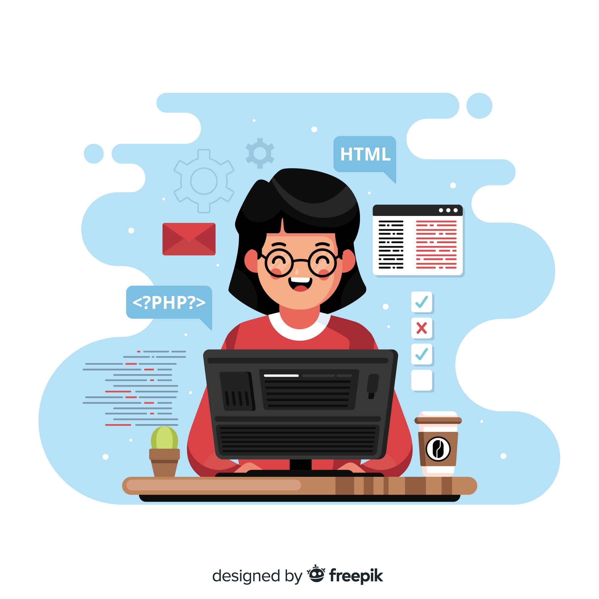

<h1 align="center">Hello Developers! I'm Sanju Kumari 😊</h1>

  

 

<h5 align="justify">An enthusiastic Full Stack Web Developer with a passion for building seamless and efficient web applications. I have a strong foundation in both front-end and back-end technologies, and I'm committed to delivering high-quality, scalable solutions.</h5>

- 🌱 Currently enhancing my skills in **TypeScript** and **Node.js**
- 🌍 Based in **New Delhi, Delhi**
- 🔥 Explore my [**Portfolio**](https://sanjukumari.vercel.app/) for more details
- 🚀 My project [**Befit**](https://be-1fit.netlify.app/) was selected as a Top Project at Masai School
- 📧 Reach out to me at [**sanju080598@gmail.com**](mailto:sanju080598@gmail.com)
- 💼 **Open to opportunities** as a MERN Stack Developer

## 📋 Table of Contents
- [About Me](#about-me)
- [What I Do](#what-i-do)
- [Technical Skills](#technical-skills)
- [Featured Projects](#featured-projects)
- [GitHub Stats](#github-stats)
- [Let's Connect](#lets-connect)

## 🎯 About Me

I'm a passionate Full Stack Web Developer from New Delhi with a strong commitment to creating user-centric applications. With hands-on experience in React, Node.js, Express, and MongoDB, I specialize in building robust web solutions that combine aesthetic design with powerful functionality.

### 🚀 What I Do

- ✅ **Full Stack Development**: Build end-to-end web applications with React on the frontend and Node.js/Express on the backend
- ✅ **Responsive Design**: Create beautiful, responsive interfaces that work seamlessly across all devices
- ✅ **Fast Learner**: Always eager to embrace new technologies and industry best practices
- ✅ **Problem Solver**: Debug complex issues and optimize performance for better user experiences
- ✅ **Actively seeking**: Exciting opportunities as a **MERN Stack Developer** to grow and contribute

### 🛠️ Technical Skills

**Frontend Technologies**

  
  
  
  
  
  
  

**Backend & Database**

  
  
  

**Tools & Platforms**

  
  
  
  
  
  
  
  

### 📁 Featured Projects

#### 1. **Befit** - Fitness & Wellness Platform 🏋️
- 🏆 Top Project Selection at Masai School
- Built a comprehensive fitness platform with React, Node.js, MongoDB, and Redux
- Features include workout tracking, nutrition plans, and progress monitoring
- **Live**: [https://be-1fit.netlify.app/](https://be-1fit.netlify.app/)
- **Tech Stack**: React | Redux | Node.js | MongoDB | Express.js

#### 2. **Portfolio Website** 💼
- Personal portfolio showcasing projects, skills, and professional journey
- Responsive design with smooth animations and user-friendly interface
- **Live**: [https://sanjukumari.vercel.app/](https://sanjukumari.vercel.app/)
- **Tech Stack**: React | Vercel | CSS3

#### 3. **Task Manager** 📋
- Dynamic Boards: Create and manage multiple boards for different projects or routines
- Kanban Workflow: Organize tasks into customizable columns (e.g., Morning, Afternoon, Evening)
- Task Management: Add, view, edit, and delete tasks with ease
- **Live**: [https://task-manager-app-sandy-seven.vercel.app/](https://task-manager-app-sandy-seven.vercel.app/)
- **Tech Stack**: React | CSS3 | Vercel

### 📈 GitHub Stats

  
  

 

  

### 📚 Learning & Development

- 📖 Continuously exploring advanced TypeScript concepts
- 🔍 Diving deeper into performance optimization techniques
- 🎓 Mastering full-stack architecture patterns
- 🚀 Building scalable applications with best practices

### 📬 Let's Connect

I'm always excited to connect and collaborate with fellow developers and teams. Let's innovate together!

  
  
  

<h4 align="center">👋 Visitor's Count:</h4>

  

  <strong>⭐ If you found my profile helpful, feel free to star some of my repositories!</strong>

